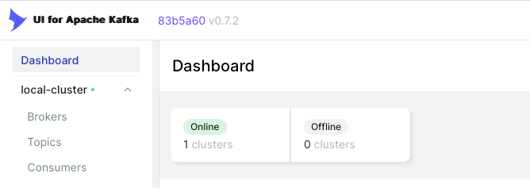
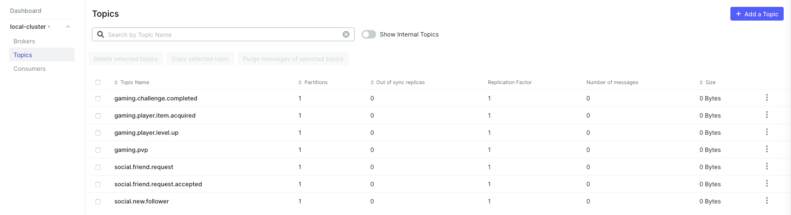
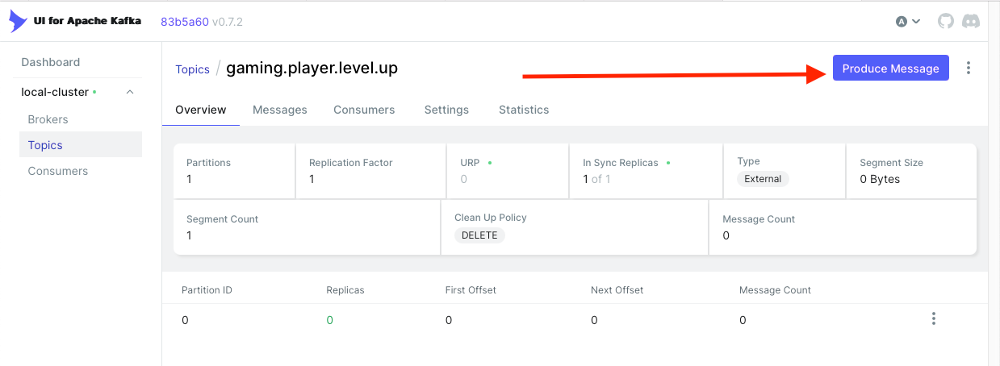
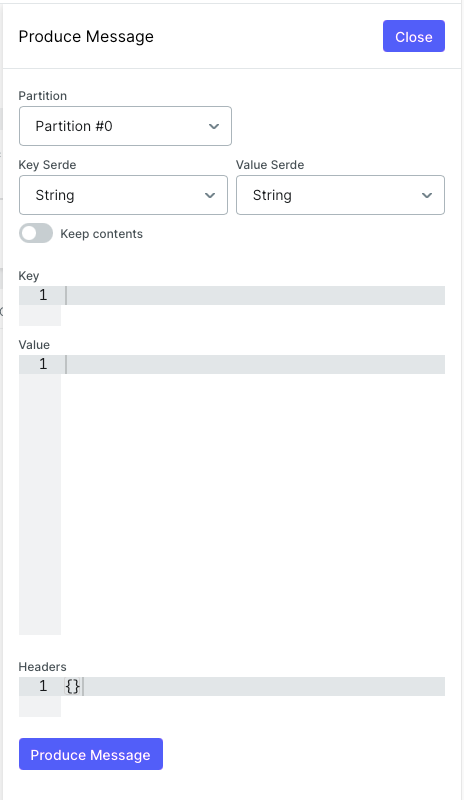

## Description

The application is based on hexagonal architecture (ports and adapters).


## Technology Stack

- NodeJS: Server-side JavaScript code execution platform
- NestJS: NodeJS framework for building scalable and maintainable applications
- Docker: For container creation
- Docker-compose: For container orchestration
- Kafka: The events broker

### Project Structure

- `src/adapters`: Adapter layer, contains the implementation of the ports defined in the application domain layer
- `src/core/application`: Application layer, contains the application's services
- `src/core/domain`: Domain layer, contains the application's entities and value objects
- `docker-compose.yml`: For service orchestration

## Project Setup

### Prerequisites

- Docker and Docker-compose installed on the system. By default, it is installed with Docker Desktop
- NodeJS v22.13.1 (npm v10.9.2) installed on the system

## Project Setup

You can run the application following typical NestJS and deploy the complete stack with Docker compose

```bash
$ npm install
```

## Compile and Run the Project

```bash
# development
$ npm run start

# watch mode
$ npm run start:dev

# production mode
$ npm run start:prod
```

## Run Tests

```bash
# unit tests
$ npm run test

# test coverage
$ npm run test:cov
```

## Deployment

The project has a [docker-compose.yml](docker-compose.yml) file that orchestrates the Localstack and Postgres services.

To start the Localstack and Postgres services, run the following command:

```bash
docker compose -p notifications-service up -d
```

After running the command and Docker builds the images, you should see output similar to the following:

```
[+] Running 5/5
 ✔ Network notifications-service_default  Created
 ✔ Container redis                        Started
 ✔ Container kafka                        Started
 ✔ Container kafka-ui                     Started
 ✔ Container notifications-service        Started
```

## Example Usage

1. **Kafka** receives an event from one of the configured topics (`GAMING_PLAYER_LEVEL_UP_TOPIC`, `GAMING_PLAYER_ITEM_ACQUIRED_TOPIC`, `GAMING_PVP_TOPIC`, `GAMING_CHALLENGE_COMPLETED_TOPIC`).
2. **Kafka Consumer** in the NestJS application consumes the event and sends it to the **GameEventController**.
3. **GameEventController** receives the event and processes it in the corresponding method based on the topic.
4. **GameEventController** delegates the processing of the event to the **Use Case** by calling `callSupportedUseCase`. The use cases follow the OCP principle of SOLID, allowing flexible integration of new validations in addition to the current idempotency validation with Redis.
5. **Redis** is used to implement idempotency by maintaining a cache of processed events. Based on a message ID, duplicate events can be discarded.
6. **Use Case** processes the business logic associated with the event.
7. **Use Case** delegates the validation of notification preferences to the **Notification Service**.
8. **Notification Service** retrieves and validates the user's notification preferences. Following the OCP principle of SOLID, the notification service can integrate new channels in a highly extensible manner without requiring structural changes.
9. **Notification Service** sends notifications through the channels that the user has active (SMS, Email, Push).
10. **GameEventController** confirms the receipt and processing of the event to **Kafka**.

```plaintext
+-------+        +----------------+        +-------------------+        +-----------+        +-------------+        +-------------------+        +-------------------+        +-------+        +-------+
| Kafka | -----> | Kafka Consumer | -----> | GameEventController | -----> | Use Case  | -----> | Redis       | -----> | Notification Service | -----> | Notification Prefs | -----> | Notification | -----> | Kafka |
+-------+        +----------------+        +-------------------+        +-----------+        +-------------+        +-------------------+        +-------------------+        +-------+        +-------+
```

### Description of the Updated Flow

1. **Kafka**: The event is published to the corresponding topic.
2. **Kafka Consumer**: The Kafka consumer in the NestJS application receives the event and sends it to the controller.
3. **GameEventController**: The controller receives the event and processes it in the corresponding method based on the topic.
4. **Use Case**: The controller delegates the business logic to the corresponding use case. The use cases follow the OCP principle of SOLID, allowing flexible integration of new validations in addition to the current idempotency validation with Redis.
5. **Redis**: Redis is used to implement idempotency by maintaining a cache of processed events. Based on a message ID, duplicate events can be discarded.
6. **Notification Service**: The use case delegates the validation of notification preferences to the notification service.
7. **Notification Prefs**: The notification service retrieves and validates the user's notification preferences.
8. **Notification**: The notification service sends the notifications through the active channels (SMS, Email, Push). Following the OCP principle of SOLID, the notification service can integrate new channels in a highly extensible manner without requiring structural changes.
9. **Kafka**: Finally, the controller confirms to Kafka that the event has been processed correctly.

## Testing the Application

For testing purposes, we will use the **kafka-ui** application, which is deployed with Docker Compose. To interact with it, simply go to your browser at the address http://localhost:8080.



From this interface, we can generate the events to which our application will react. To do this, we must go to the Topics section where we can see the list of topics currently in Kafka.



Now we are ready to generate those events. Remember that in a production environment, other parts of the system automatically generate messages on the topics to be processed!

Select any topic and then go to the Produce Message option in the panel.



Now we can generate our messages.



Here [extracted_topics.json](resources/extracted_topics.json) you can find message examples for each topic, but let's start with one quickly.

Take this example for the `gaming.player.item.acquired` topic:
```json
{
  "messageId": "PffW7grm7P5yws9PMws8V",
  "timestamp": "1740830925",
  "userId": "1",
  "itemName": "SwordOfAzeroth"
}
```

You will see log entries in the application similar to this:

```
[Nest] 1  - 03/01/2025, 9:24:29 PM     LOG [GameEventController] Event received: PffW7grm7P5yws9PMws8R timestamp: 1740830925
[Nest] 1  - 03/01/2025, 9:24:29 PM     LOG [SMSNotificationsChannel] Message You've acquired SwordOfAzeroth item sent
[Nest] 1  - 03/01/2025, 9:24:29 PM     LOG [EmailNotificationsChannel] Message You've acquired SwordOfAzeroth item sent
[Nest] 1  - 03/01/2025, 9:24:29 PM     LOG [PushNotificationsChannel] Message You've acquired SwordOfAzeroth item sent
[Nest] 1  - 03/01/2025, 9:24:29 PM     LOG [ItemAcquiredEventUseCase] Event PffW7grm7P5yws9PMws8R processed
```

Note that in the dummy database (an in-memory map of the application), the notification preferences of 3 users are registered. Each one has its own active channels (SMS, PUSH, Email). According to these configurations, the application will decide which channels to activate for the simulated sending of these notifications.

